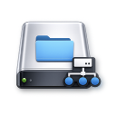
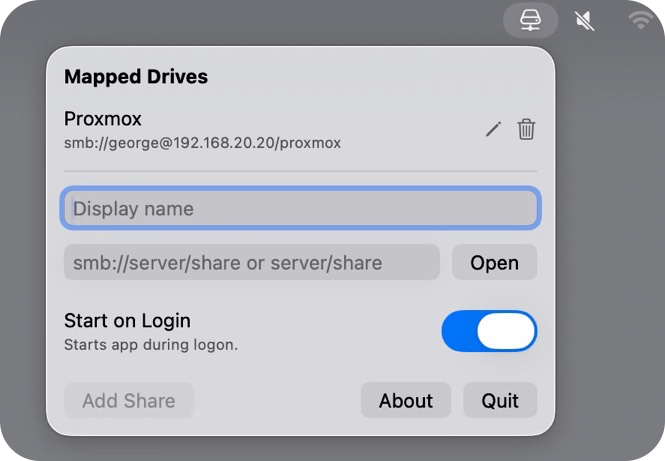

<div align="center">

<picture>
  <source srcset="Documentation/icon-dark.png" media="(prefers-color-scheme: dark)">
  <source srcset="Documentation/icon-light.png" media="(prefers-color-scheme: light)">
  
</picture>
<br/><br/>

<h2>MappedDrive is a lightweight macOS menu bar app for saving and opening SMB shares quickly.<br></h2>
<br><br>

</div>

<p align="center">
    <a href="Documentation/App1.png"></a>
</p>

## Features

- Lives in the macOS menu bar.
- Shows a list of saved shares.
- Opens shares in Finder with one click.
- Lets you add shares manually (`smb://server/share` or `server/share`).
- Lets you browse to a mounted network folder with `Open` and save it.
- Supports editing and deleting saved shares.
- Supports Start on Login.


## 🖥️ Install & Minimum Requirements

- macOS 14.0 or later  
- Apple Silicon & Intel
- ~10 MB free disk space  

### ⚙️ Installation

Download from Releases. It's signed & notarized.

### ⚙️ Build it yourself!

Clone the repo and build with Xcode:

```bash
git clone https://github.com/gbabichev/MappedDrive.git
```

## 📝 Changelog

### 1.0.0
- Initial Release.

## 📄 License

MIT — free for personal and commercial use. 